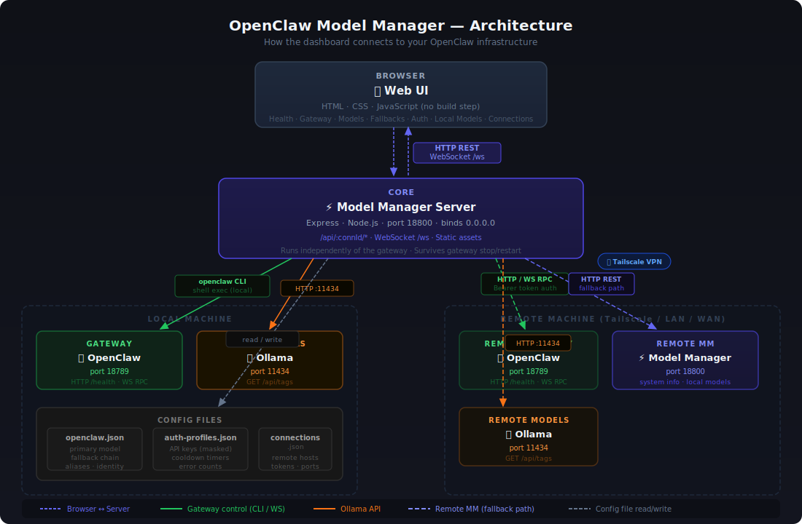

# OpenClaw Model Manager: A GUI for the Power Users Who Hate Waiting

*How we built a standalone web dashboard to tame OpenClaw's CLI — and what it taught us about AI infrastructure in the real world.*

---

## The Problem Nobody Talks About

OpenClaw is genuinely powerful. It runs a local AI gateway that routes your conversations through any combination of models — Anthropic, OpenRouter, Google, local Ollama models — with fallback chains, auth profiles, aliases, and session management baked right in. Once it's configured, it mostly just works.

But "mostly just works" hides a lot of friction.

Want to know if your gateway is running? `openclaw gateway status`. Want to change your primary model? Edit a JSON config file, then restart the gateway. Want to see which provider is in a rate-limit cooldown? Good luck — dig through `auth-profiles.json` manually. Want to check if your RTX 3060 can actually run that 34B parameter model? Open a calculator.

The tools are all there. They're just scattered, CLI-only, and invisible when you need them most.

That's why we built **OpenClaw Model Manager**.

---

## What It Is

OpenClaw Model Manager is a standalone web dashboard that wraps OpenClaw's existing CLI and config files with a clean, dark-themed UI. It runs as its own Express server on port `18800` — completely independent of the OpenClaw gateway itself. That's intentional: the manager doesn't go down when the gateway does, and it's how you bring the gateway back up when it's offline.

It's not a replacement for OpenClaw. It's a control panel for it.

**No build step. No framework. No dependencies beyond Express and `ws`.** Just static HTML, CSS, and JavaScript backed by a thin Node server that shells out to the same `openclaw` CLI you'd use in your terminal.

Bind it to `0.0.0.0:18800` and it's accessible over Tailscale or your local network from any device — your phone, a laptop on the couch, a remote machine across the country.

---

## The Architecture



> The full interactive diagram is available at `http://localhost:18800/architecture.svg` when the Model Manager is running.

At its core, the architecture has three layers:

**Browser → Express Server → Infrastructure**

- The browser talks to the Express server over HTTP REST and a WebSocket for live status pushes
- For **local connections**, the server shells out to the `openclaw` CLI — the same commands you'd run in a terminal
- For **remote connections**, it talks to the remote machine's Model Manager instance over HTTP, with a Bearer token for auth
- Config files (`openclaw.json`, `auth-profiles.json`, `connections.json`) are read and written directly — no custom database, no sync layer

The server is the only always-on component. The gateway can start, stop, and restart without taking the dashboard down.

---

## The Features, And Why They Matter

### 🔌 Gateway Control

Start, stop, and restart the OpenClaw gateway with a single button click. Status is shown in real time — running, stopped, or unknown. A live WebSocket connection pushes updates every few seconds so you always know what state you're in without refreshing.

**Why it matters:** Restarting the gateway after config changes is a fact of life. Having a button is better than having a terminal open.

### 📊 Live System Health

The Health tab shows a plain-English summary of what's happening on your machine right now:

- **GPU VRAM bars** with utilization percentage and temperature for each card — refreshed every 3 seconds
- **RAM usage** with available memory
- **Model offload detection** — whether your current model is running entirely on GPU, split across GPU and CPU, or running in CPU-only mode
- **Gateway status** in human language, not raw JSON

Under the hood, this calls `nvidia-smi` for GPU data and the OpenClaw health endpoint for gateway state. Everything is presented as readable cards, with expandable raw JSON for when you need the technical details.

**Why it matters:** "Is my model running on GPU?" shouldn't require opening a terminal. Neither should "How hot is my GPU right now?"

### 🚨 Provider Failover Panel

This one was born from real pain.

During development, switching primary models repeatedly triggered Anthropic's rate limiter. The gateway put Anthropic on a 5-minute cooldown — but the first fallback in the chain was *also* an Anthropic model. So both were blocked. The error messages were confusing, the fix required editing a JSON file, and there was no visibility into what was happening.

The Failover Panel solves all of this at once. It lives at the top of the Health tab so you see it immediately when something's wrong:

- **Red border** appears the moment any provider enters cooldown
- **Countdown timers** show exactly how long until each provider recovers
- **Error counts** per provider so you can see if it's a blip or a pattern
- **"Switch To ⚡"** button hot-swaps your primary model to any ready provider *instantly* — no gateway restart, no JSON editing, no waiting
- **"Clear Cooldown"** resets a provider's error state immediately if you know the rate limit has lifted

The panel auto-refreshes every 5 seconds while any cooldown is active, then stops polling once everything is healthy.

**Why it matters:** When you're in the middle of a conversation and your primary model goes down, you need one click to fix it — not a terminal and a config file.

### 🧠 Model Management

The Models tab gives you full control over your model configuration:

- **Set your primary model** from a dropdown of everything OpenClaw knows about
- **Add new models** — external API models (Anthropic, OpenRouter, OpenAI, Google, Mistral, Groq, Together, DeepSeek) or local Ollama models
- When you select a provider to add a model, the UI immediately checks whether you have credentials configured — so you know before you try

### 🔗 Drag-and-Drop Fallback Chain

Your fallback chain is the safety net that keeps conversations going when your primary model fails. OpenClaw tries each model in order until one works. Getting that order right matters.

The Fallbacks tab lets you manage it visually:

- **Drag tiles** by their grip handle (⠿) to reorder
- **Numbered badges** show current priority at a glance
- **Provider badges** (☁️ cloud vs 💻 local) let you see your balance of cloud and local models
- **Add from dropdown** — grouped by provider, with already-added models automatically excluded
- An **"Unsaved changes" indicator** (pulsing dot + Save button) appears the moment you make any edit

Saves write directly to your `openclaw.json` config. A warning banner reminds you that a gateway restart is needed to apply the changes.

**Why it matters:** The right fallback order is the difference between a 500ms retry to OpenRouter and a 25-minute wait for Anthropic to recover.

### 🔑 Credential Management

The Auth tab shows the status of every API key you've configured:

- Keys are displayed **masked** (first 6 + `••••••` + last 4 characters) — enough to identify which key is loaded without exposing it
- ✅ active · ❌ error/missing · 💻 local (no key needed)
- **Cooldown timers** and **error counts** per profile
- **OAuth expiry** for providers that use device-flow auth
- An **Add/Update Credential form** lets you paste a new API key directly in the UI

### 🦙 Local Model Compatibility

The Local Models tab connects to your Ollama instance and shows every model you have installed — alongside an honest assessment of whether your hardware can run it:

- **✅ Fits on GPU** — full VRAM available, will run fast
- **⚠️ Partial GPU** — will split between GPU and RAM (slower)
- **💻 CPU only** — too large for GPU, will be slow
- **❌ Won't fit in RAM** — model is larger than your total system RAM

VRAM requirements are estimated as model size × 1.2 (20% overhead for KV cache). For a system with 2× RTX 3060 (24GB total VRAM), this gives you a realistic picture of which 7B, 13B, and 34B models are actually usable day-to-day.

### 🌐 Remote Connection Manager

The Connection Manager lets you add any OpenClaw instance — local or remote — and switch between them with a single dropdown. Each connection stores host, port, bearer token, and optional Model Manager and Ollama ports.

Switch connections and every tab immediately updates to show data for that instance.

### 🔍 Remote Connectivity Test

Before managing a remote instance, you need to know what's reachable. The Connectivity Test probes three endpoints in parallel with 5-second timeouts:

1. **OpenClaw Gateway** — is port 18789 accessible?
2. **Model Manager** — is the remote dashboard running?
3. **Ollama** — is the local model server reachable?

Results come back as cards with plain-English explanations — firewall, gateway not running, wrong port — and expandable raw responses for debugging.

---

## A Real-World Story

Here's what the failover panel is actually for.

During a session testing the model switcher, we rapidly changed the primary model several times. Anthropic noticed and rate-limited the API key. The gateway put Anthropic on a 5-minute cooldown and started trying fallbacks — but the first fallback was *also* on Anthropic, so it was also blocked. The second fallback was OpenRouter, which worked fine, but not before showing the user a confusing "API rate limit reached" error multiple times.

The fix at the time: edit `openclaw.json`, reorder the fallbacks, restart the gateway. Five minutes of friction.

With the Failover Panel: see the red border, click "Switch To ⚡" on OpenRouter, done. The model changes instantly. Total time: 3 seconds.

---

## Getting Started

### Prerequisites

- [OpenClaw](https://github.com/openclaw/openclaw) installed and configured
- Node.js 18+
- (Optional) Ollama for local model support

### Quick Start

```bash
git clone https://github.com/chriskesler35/openclaw-model-manager
cd openclaw-model-manager
npm install
npm start
```

Open `http://localhost:18800` in your browser.

### Tailscale / Remote Access

Because the server binds to `0.0.0.0`, it's immediately accessible on any network interface — including Tailscale. From any device on your Tailscale network:

```
http://<your-tailscale-ip>:18800
```

To manage a remote OpenClaw instance, add it as a connection in the Connections tab with the remote machine's Tailscale IP and your gateway token.

---

## The Bottom Line

OpenClaw is already a powerful tool. OpenClaw Model Manager makes it a tool you can actually manage without keeping a terminal open at all times.

If you're running multiple OpenClaw instances, dealing with provider rate limits, trying to figure out which Ollama models will actually run on your GPU, or just want a dashboard that shows you what's happening in plain English — this is for you.

It's free, open source, and took one morning to build from scratch.

---

*Built with Express, WebSockets, and stubbornness. Dark mode only. No build step required.*

**Repository:** [github.com/chriskesler35/openclaw-model-manager](https://github.com/chriskesler35/openclaw-model-manager)
